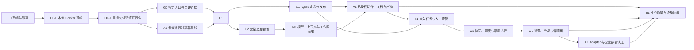

# 受治理企业 Agent 平台路线图 v1

## 状态

草案。该文档是程序级路线图，不是任一后续能力的实现批准，也不表示任何实验性代码已经可用、可部署或满足终局要求。

当前只有 F0 完成了其自身的隔离门禁：

- F0 已完成生产可达遗留实验面的隔离；其[规格与证据](../f0-legacy-isolation-v1/README.md)不批准或启用任何 Remote Turn、Agent、PC 或外部 adapter。
- D0-L 本地 Docker 基线处于 Draft：已验证的 dev-instance 是宿主 Node 加 Docker 依赖的混合形态，不是全容器控制面。D0-L 先验证本机 Docker 的可重复启动、持久化、重启和经受限宿主验证器的真实文本模型路径；Portal 浏览器/OIDC/Admin 留给独立的 D0-Lb 规格。
- D0-T 目标交付环境可行性在当前 checkout 为 blocked/no-go：这里只有上游的 deploy/layers README，没有私有逐项覆盖表、目标环境兼容性/恢复证据或已批准差异。参考材料只能作为设计输入，不能代替这些证据。
- G0 与 X0 是 F1 之前必须完成的私有部署层前置门禁，且尚未开始验收。
- F1 的 [Remote Turn v1](../remote-turn-v1/README.md) 是候选规格，仍处于 Draft，尚未获得正式 Gate 1 批准或通过实现验收。
- 其余阶段均为方向性能力，开始前必须各自建立独立规格、三轮 walkthrough、AC 到测试映射、风险与回滚记录。

## 目的

终局不是做出一个 Gateway 页面、Registry API 或某一个供应商 adapter。终局是一个受治理的企业 Agent 执行与运营平台：已验证用户只能经指定入口发起工作；平台只把工作交给已批准、可证明受控的运行时；所有高风险能力、外部动作和运维控制都可追踪、可停止、可回滚。

本路线图把这个终局拆成可独立验收的能力，避免把设计说明、演示路径或存储接口误报为已交付的生产能力。

## 事实来源与证据层级

| 层级 | 可以证明什么 | 不可以证明什么 |
| --- | --- | --- |
| 部署项目维护的业务需求覆盖表 | 终局需求、外部集成、验收约束与责任方 | 当前代码已实现某项能力 |
| 代码、自动化测试、独立审查、canary 与回滚演练 | 已实现行为及其证据范围 | 未测试的设计承诺或外部系统行为 |
| 设计稿、调研、基准和演示记录 | 候选方案、风险、待验证假设 | 安全控制、SLO 或交付完成度 |

该仓库的 `origin` 是上游 QM。因此本路线图只规定 vendor-neutral 的核心能力。具体运行时、入口/治理系统协议、设备管理、密钥、镜像、网络策略、业务系统和运营材料必须位于相应私有部署项目的 `deploy/layers/<org>/` 中，并由该项目维护其需求覆盖表。

上游路线图不能替代该覆盖表，更不能把多个编号需求合并为“一个 adapter”或“一个场景”。私有部署项目必须逐项保留业务需求编号、来源版本、红线/验收条件、责任方、对应阶段、核心或部署层归属、功能规格、验收证据、验收人和未完成状态；模板见[业务需求覆盖协议](./05-business-requirements-coverage.md)。D0-T 不完成此项盘点，B1 不得宣称终局达成。

## 终局目标

在统一入口、统一身份权限和外部治理授权的约束下，提供一个可插拔、统一纳管的 Agent 执行与运营平台：

1. 已验证用户在已授权 scope 内发起任务，系统以服务端派生的身份、组织和权限处理请求。
2. 已验证的云端、设备端或外部运行时只能在最小权限、隔离、受控网络出口、预算和风险审批约束下执行。
3. 任务、Skill、工具、模型、终端、产物和结果形成完整且耐久的审计链；用户可获得进度、结果、取消、暂停/恢复与人工接管能力。
4. 运行时、Agent 定义、版本、策略和外部能力均可被真实停用、撤权、回滚和追责；成功响应必须对应实际完成的动作。
5. 平台只消费外部治理权威已授权的 Skill/能力状态，不绕过该权威直接调用受管业务系统。
6. 平台最终以至少一个可复验的业务端到端场景证明价值，而不是仅以 API、页面或基准结果声明完成。

## 终局边界

- Skill 创建、审核、发布与市场运营是外部生命周期/治理系统的责任；本平台仅同步、验证、加载、执行、记录与停用已授权的能力。
- 不把任何供应商、模型、Agent 框架、运行时、设备类型或沙箱提供商当成核心的前置事实。每个 adapter 都必须单独认证。
- 不把单一已配置组织的实现误称为通用多组织平台；公开共享、跨组织、跨集群和跨地域必须在各自的数据与授权模型被批准后再启用。
- 安全、审计、预算、隔离、egress 和回滚是每个能力的放行条件，不是最后才补的运营功能。

## 能力依赖图

能力可并行设计或调研，但只能按依赖图顺序启用。D0-L 是本机先行验证，不预设 Kubernetes；D0-T 的真实目标可在未来选择单机 Docker、VM、ECS 或 Kubernetes，但必须按最终选定 profile 单独证明。任何前置阶段未达到其 Exit Gate，后续阶段不得借用其实验性接口、绕过其约束或对外宣称可用。

F1 使用由 X0 证明的参考运行时，并以 G0 的入口和治理连接作为唯一进入路径；X0 的身份、attestation、强制 egress、终止和回滚证据是 F1 的硬前置。D0-T 还必须证明 F1 所需持久化与一致性契约在目标环境可用，或在 F1 获得正式 Gate 1 前批准并更新其替代设计。D0-L 仅为本地 Docker QA 建立控制面、持久化与真实文本模型证据，不能替代 D0-T 或放行 F1。X1 不为 F1 补票；它只认证 F1 参考运行时之外的新增运行时或设备类型。一个参考运行时的证明也不能外推为其他 adapter、设备、升级路径或运行形态已受支持。

## 能力路线概览

| 阶段 | 用户/运营结果 | 明确不做 | 启用前必须证明 |
| --- | --- | --- | --- |
| F0 基线与隔离 | 正常 QM 路径不再意外触达遗留实验面 | 修复后继续叠加 Gateway 功能 | 遗留路由、配置、环境、持久化选择和 wiring 全量不可达清单与 CI |
| D0-L 本地 Docker 基线 | 开发者可复现本机全容器控制面、持久化、重启和经受限宿主验证器的真实文本模型验证 | 将混合 dev-instance 或本机 Docker 视为生产隔离、Kubernetes、HA、Portal 浏览器 E2E 或 Remote Turn 证明 | 全容器控制面、loopback 端口、非 purge 持久化、真实文本模型、secret 边界与 execute fail-closed 证据 |
| D0-T 目标交付环境可行性 | 交付方知道每项需求、红线、目标环境和量化验收如何落到后续阶段 | 用本机或默认依赖替代目标环境证明 | 私有逐项覆盖表；目标持久化/网络/运行环境/许可/升级/高可用可行性证据，或已批准差异 |
| G0 指定入口与治理连接 | 受保护请求只能经指定入口，并逐次取得外部治理授权和审计回执 | 浏览器、环境变量或 runtime 自行冒充身份/授权 | 服务端身份链、trace/error/result 映射、能力状态同步、原子调用鉴权、审批和审计回执的私有层 contract proof |
| X0 参考运行时部署基线 | 一个参考运行时在目标环境中可被证明隔离、受控出网、停止与回滚 | 将自报配置、宿主进程或直连网络视为证明 | 固定 release/镜像、工作负载身份、attestation、非旁路 egress、令牌注入、终止和撤权演练 |
| F1 受信任执行核 | 一个已授权 scope 完成一次受保护的无副作用文本执行 | 流式、文件、工具、常驻/后台 Agent | D0-L/D0-T/G0/X0 已通过；事务性身份/状态/预算/审计、一次 lease、可信 egress/终止与回滚 |
| C1 Agent 定义与发布 | 授权方管理版本化、不可变的 Agent 定义和 Release 记录 | Host spawn、假 online/health、浏览器直改策略 | server-side ACL、版本、配额、真实状态与跨实例恢复 |
| C2 受控交互会话 | 用户可安全进行顺序多回合、流式和断连恢复交互 | 任何工具、文件或跨回合副作用 | session 隔离、持久生命周期、取消与恢复语义 |
| M1 模型、上下文与工作区治理 | 服务端按策略选择模型，并隔离、更新、删除和审计上下文/记忆/工作区 | 用户或 runtime 任意选模型、共享记忆或越界文件 | 模型路由/QoS/计量/效果评估；按用户/Agent/场景/权限隔离的上下文、记忆和工作区生命周期 |
| A1 已授权动作、文档与产物 | 已授权 Skill/工具/文件/文档/记忆在边界内执行并可撤销追踪 | 自动导入、任意扩展、未授权写入 | capability、审批、产物账本、输入输出与数据安全、密钥/egress、删除与补偿证据 |
| T1 持久任务与人工接管 | 长任务可暂停、恢复、取消、验证结果和人工接管 | 以自动重试掩盖副作用不确定性 | durable task/子任务/结果验证、幂等/补偿、失败节点恢复 |
| C3 协同、调度与常驻执行 | 可授权地发送消息、运行计划工作并处理故障 | 内存队列、cron 文本或假心跳冒充执行 | durable outbox/inbox、DLQ、循环控制、lease、catch-up 与终止证明 |
| O1 运营、合规与管理面 | 运维人员看到后端真相并可真实执行处置 | 成功形状的空操作、UI 绕过后端控制 | 审计读取隔离、实时通知/分析、真实急停/撤权/会话阻断/策略回滚、备份恢复、发布兼容性与控制 API 后的 UI |
| X1 Adapter 与企业部署认证 | F1 参考运行时之外，一个新增运行时或设备类型可被安全接入和停用 | 未认证 adapter、跨组织共享 | 每类 adapter 的身份、隔离、策略、撤权、审计和迁移证据 |
| B1 业务场景与终局验收 | 私有覆盖表指定的业务场景、文档/文件范围、必达运行形态和量化目标均可复验地达成 | 仅展示技术 API 或基准；用任意 demo 替代指定范围 | 需求覆盖、业务验收、原始目标的统计口径、回滚演练和独立评审 |

## 通用阶段门禁

每一阶段均按下列状态推进：`draft -> walkthrough-approved -> tdd-approved -> in-progress -> review-ready -> complete`。

进入下一状态的最低证据：

1. 规格明确 In/Out、用户故事、非目标、风险、回滚和所有权。
2. 三轮 walkthrough 闭合用户路径、技术状态/API 契约、集成和失败路径。
3. P0/P1 验收先有红测试；行为完成后具备正向、负向、重启和跨实例证据。
4. 所有外部副作用均有最小权限、授权、幂等或补偿、审计和真实停止语义。
5. canary、回滚演练、运行手册、文档和独立新鲜上下文审查通过后，才扩大 scope。

以下任一情形立即 Stop，不扩大范围：跨 scope 泄露、重复外部执行、没有证明的完成/取消、无审计成功、未授权 egress、无法停止的运行时，或外部治理授权被绕过。

## 量化验收原则

已批准业务或合同需求中的量化指标是终局的硬验收条件，不是候选目标，也不能因尚未采集基线而被重新降格或省略。其具体数值和适用范围只保存在私有部署项目的逐项覆盖表中，以避免把组织专属约束写入上游核心。

每个指标必须先定义：原始目标、分母、排除条件、观测窗口、数据来源、告警阈值、责任人和防篡改链路；随后在 canary 中采集基线并由验收人确认测量口径与验收窗口。基线用于证明是否达标，不能改变原始目标；未经该流程的数字不得写为已达成的 SLO。

## 关联文档

- [Round 1：终局用户故事](./01-user-stories.md)
- [Round 2：能力与系统边界追踪](./02-capability-trace.md)
- [Round 3：阶段门禁与失败处理](./03-gates-and-evidence.md)
- [阶段验收矩阵](./04-phase-acceptance-matrix.md)
- [业务需求覆盖协议](./05-business-requirements-coverage.md)
- [当前本地 Docker 基线规格：D0-L](../d0-local-docker-baseline-v1/README.md)
- [当前 F1 候选规格：Remote Turn v1](../remote-turn-v1/README.md)
